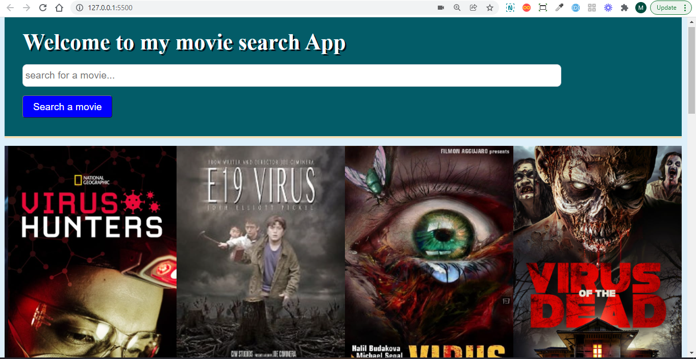
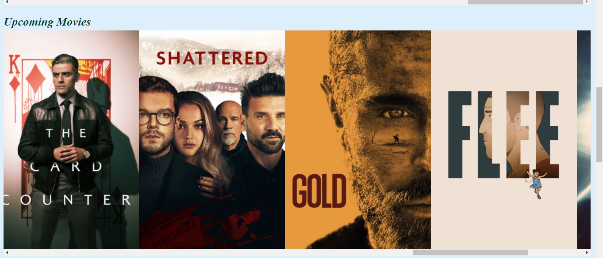
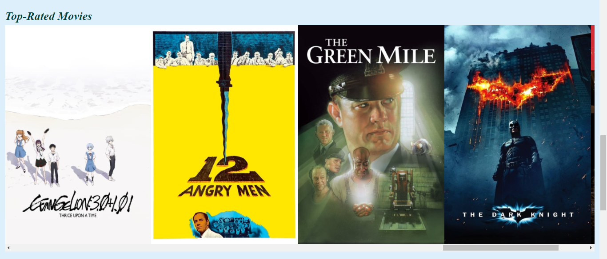
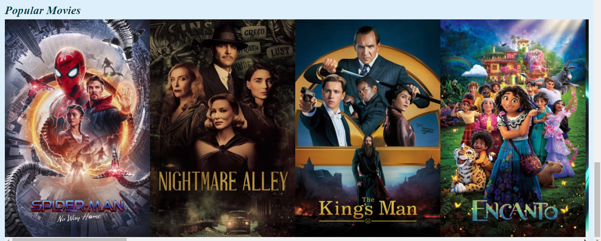
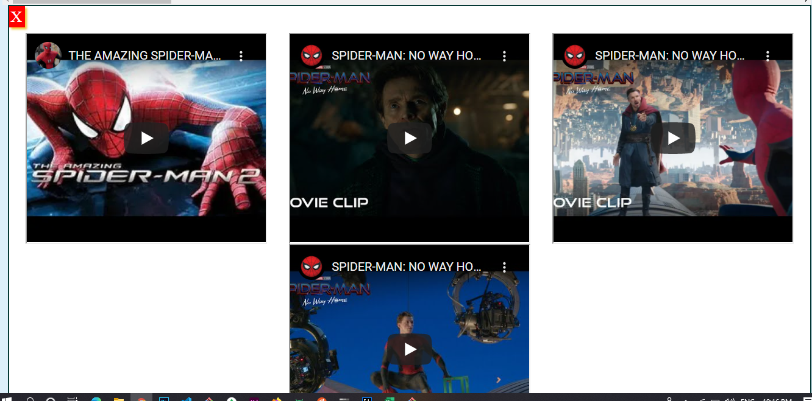

# Movie Search App 

## Description 
This is a movie search app built using html5, CSS3, and Javascript. It uses 3rd party MovieDB API to fetch movies of different categories. 

## Installation 
No installation, this application is to be used on the browser. If wanting to work on contents of the application, user will need to clone the repo and install dependencies. 

## Usage 
This application will allow users to search for movies and will be able to click on them to watch the movie trailers. 
 
 
 
 
 

## License 
This project is license under MIT

## Contributing 
Contributors should read the installation section. 

## Tests
No tests are used in this application.
